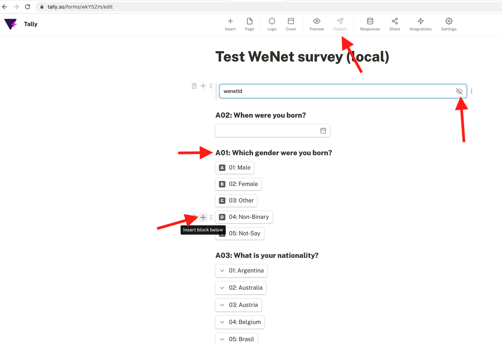

### Survey app components

The following steps are required for creating a survey 

**1. Creating and configuring a survey form on Tally**
 

### Creating a workspace on Tally
* Go to [Tally](https://tally.so) and create your workspace
* Click *create workspace* on the left side of the page
* Assign a name
* Click on *Integrations* column to add webhook endpoint
* Webhook endpoint should be filled as https://survey.wenet.u-hopper.com/survey/event/
* Click on *Edit* button on top right to start adding surveys

### Editing a workspace on Tally

* Create a hidden text field written with _wenetId_ inside. This will help the survey app which user is currently logged in to the survey. If this field doesn't exist, survey will not work.
* Click on *plus* (+) button to add more survey questions and answers
* When adding a survey, question code and answer codes followed by a *colon* (:) must be written in the survey. For example, question code **A01:** must put before the quiestion **Which gender you were born?** Same goes for the answers following (**01: Male, 02: Female ...** etc.).
It's necessary to put the *Question and Answer* codes in the field, because wenet survey app reads the Tally survey answers as JSON data and parses it into the application questions using *Question and Answer codes* writtent in the field.
*Question and answer* codes can be found in [this spreadsheet](https://docs.google.com/spreadsheets/d/1SyTqCyAmXLVuIPa2CqOf4z7n8B1Qsv5O/edit#gid=1590011795)
* Survey should be created as a format of *question + following answers field types*. 
    
    Following field types are supported in wenet-survey-app when creating a survey in Tally:
    * Multiple choice
    * Checkbox
    * Number
    * Date
    * Dropdown menu
    * Rating
    * Linear scale
* To create question **A02**: use *Question + Date* field
* To create questions **A03, A11**: use *Question + Dropdown* field
* To create **Q09, C02, G02, G05, G07, B01, B02**: use *Question + Linear scale* field
* To create **A07**: use *Question + Number* field 
* To create **A01, A11, C01, C04, C07, D03, D04, G01, G17**: use *Question + Multiple choice* field.
* To create language field **Q07**:
    * First, create Question + Checkboxes field, with a code Q07: included in the question field
    * Add language options including the [language and its proficiency codes](https://docs.google.com/spreadsheets/d/1SyTqCyAmXLVuIPa2CqOf4z7n8B1Qsv5O/edit#gid=1590011795)
    * Add *Question + Dropdown* field for every language input and it's level of proficiency (with their code) and make it *hidden*.
    
    * Add Conditional logic field following the example.
    The logic should trigger when the language field is seleced from the checkbox, enable the corresponding Question + Dropdown (language code + level code) field from the field Q07.
    Complete the logic and hidden fields for all given languages.
    
    
* Missing **A04, A05, Q06** fields tbd :warning:
* Click *Publish* button on top of the page to save the survey.

**2. Add required permissions on wenet developer hub**

* Enable the wenet user profile permissions on [wenet hub -> developers -> survey app](https://wenet.u-hopper.com/dev/hub/frontend/developer/index)

