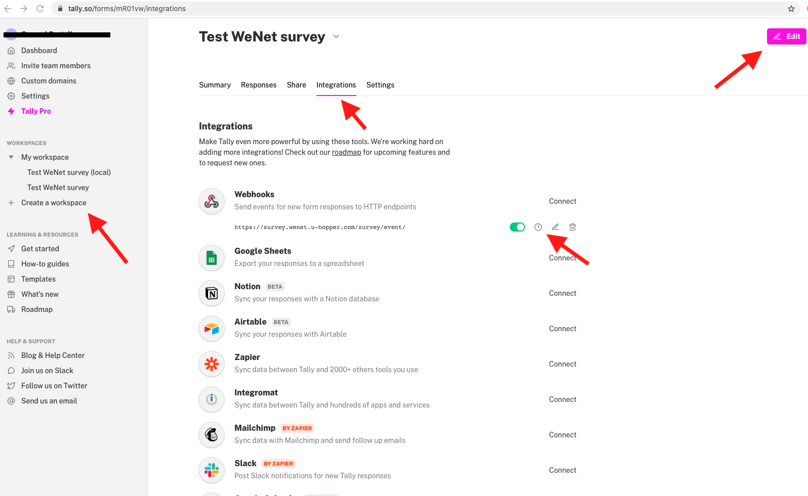
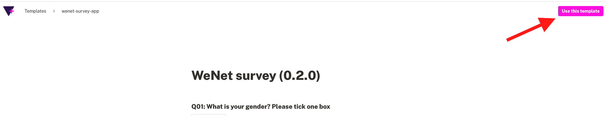
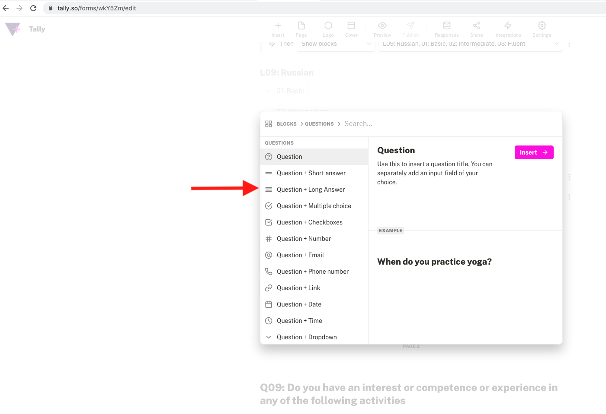
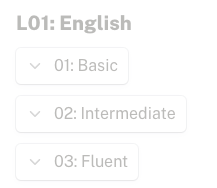
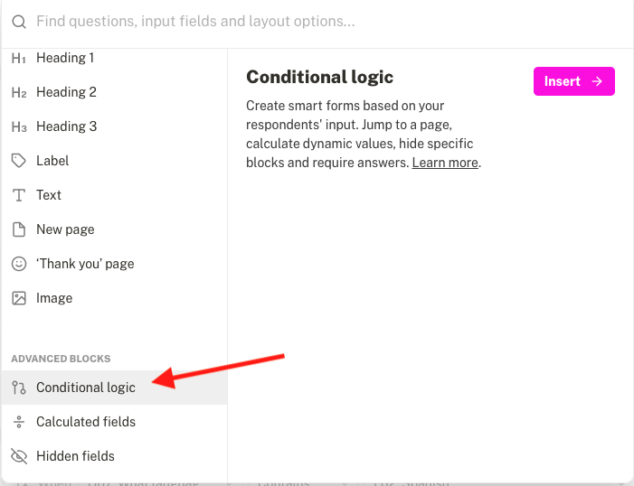
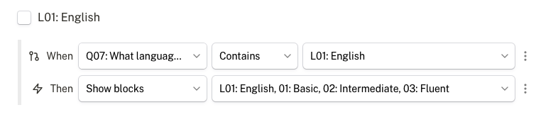
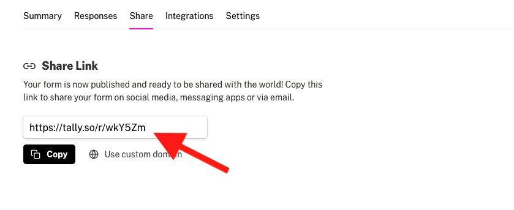

### Survey app components

The following steps are required for creating a survey 

### Creating a survey form on Tally

* Go to [Tally](https://tally.so) and create your workspace
* Click *create workspace* on the left side of the page
* Assign a name
* Click on *Integrations* column to add webhook endpoint
* Webhook endpoint should be filled as https://survey.internetofus.u-hopper.com/survey/event/
* Click on *Edit* button on top right to start adding surveys

### Using a survey template on Tally

* Login to your Tally page
* Access the following [link](https://tally.so/templates/wenet-survey-app/rm67P3)
* Click on the *Use this template* button on the top right corner and edit the questions/answers 

* Click *Publish* button on top of the page to save the survey after the edit

---
**NOTE**

Pay attention to the logic and hidden field triggers and selections. Make sure the logic stays the same after changing the answer texts.

---

<!-- 
### Editing a workspace on Tally

* Create a hidden text field written with _wenetId_ inside. This will help the survey app which user is currently logged in to the survey. If this field doesn't exist, survey will not work.
* Click on *plus* (+) button to add more survey questions and answers
* When adding a survey, question code and answer codes followed by a *colon* (:) must be written in the survey. For example, question code **A01:** must put before the quiestion **Which gender you were born?** Same goes for the answers following (**01: Male, 02: Female ...** etc.).
It's necessary to put the *Question and Answer* codes in the field, because wenet survey app reads the Tally survey answers as JSON data and parses it into the application questions using *Question and Answer codes* writtent in the field.
*Question and answer* codes can be found in [this spreadsheet](https://docs.google.com/spreadsheets/d/1SyTqCyAmXLVuIPa2CqOf4z7n8B1Qsv5O/edit#gid=1590011795)
* Survey should be created as a format of *question + following answers field types*. 
    
    Following field types are supported in wenet-survey-app when creating a survey in Tally:
    * Multiple choice
    * Checkbox
    * Number
    * Date
    * Dropdown menu
    * Rating
    * Linear scale
* To create date type questions: use *Question + Date* field
* To create single choice from dropdown questions : use *Question + Dropdown* field
* To create questions with answers selectable from multiple numbers: use *Question + Linear scale* field
* To create questions: use *Question + Number* field 
* To create questions with multiple selectable answers: use *Question + Multiple choice* field.
* To create a question with answer range is hidden while unselected: For example, language field
    * First, create Question + Checkboxes field, with a code Q07: included in the question field
    * Add language options including the [language and its proficiency codes](https://docs.google.com/spreadsheets/d/1SyTqCyAmXLVuIPa2CqOf4z7n8B1Qsv5O/edit#gid=1590011795)
    * Add *Question + Dropdown* field for every language input and it's level of proficiency (with their code) and make it *hidden*.
    
    * Add Conditional logic field following the example.
    The logic should trigger when the language field is seleced from the checkbox, enable the corresponding Question + Dropdown (language code + level code) field from the field Q07.
    Complete the logic and hidden fields for all given languages.
    
    
* Click *Publish* button on top of the page to save the survey. 
-->

Once the survey is saved, the Tally form ID should be shared with the developers.
The survey ID is a six-character ID and it can be found in *Share* column.

### Adding required permissions on wenet developer hub

* Enable the wenet user profile permissions on [wenet hub -> developers -> survey app](https://wenet.u-hopper.com/dev/hub/frontend/developer/index)

### List of questions and answers
* Full list of *Questions and answers* codes can be found in [this spreadsheet](https://docs.google.com/spreadsheets/d/1SyTqCyAmXLVuIPa2CqOf4z7n8B1Qsv5O/edit#gid=1590011795)
* List of APIs related with the user profile can be found [here](https://swagger.u-hopper.com/?url=https://bitbucket.org/wenet/wenet-components-documentation/raw/master/sources/wenet-profile_manager-openapi.yaml)

* List of *Questions, answers and fields* and their assigned profile entries used in Pre-Pilot are shown below

| Question Code |               Answers               | Competences Meanings Materials | Ontology Category Classification |                                                 Variable Name                                                |
|:-------------:|:-----------------------------------:|:------------------------------:|:--------------------------------:|:------------------------------------------------------------------------------------------------------------:|
|      Q01      |                 list                |              None              |               None               |                                                   *gender*                                                   |
|      Q02      |                number               |              None              |               None               |                                                *date_of_birth*                                               |
|      Q03      |                 list                |            Materials           |        *university_status*       |                                                 *department*                                                 |
|      Q04      |                 list                |            Materials           |        *university_status*       |                                              *degree_programme*                                              |
|      Q05      |                 list                |            Materials           |        *university_status*       |                                                *accommodation*                                               |
|     Q06a-0    |   number 1-5 mapped to 0-1 values   |           Competences          |            *interest*            | see column [G](https://docs.google.com/spreadsheets/d/1SyTqCyAmXLVuIPa2CqOf4z7n8B1Qsv5O/edit#gid=1590011795) |
|     Q07a-h    |   number 1-5 mapped to 0-1 values   |           Competences          |       *university_activity*      | see column [G](https://docs.google.com/spreadsheets/d/1SyTqCyAmXLVuIPa2CqOf4z7n8B1Qsv5O/edit#gid=1590011795) |
|     Q08a-r    | number 1-5 calculated to 0-1 values |            Meanings            |       *guiding_principles*       |                                                 *excitement*                                                 |
|     Q08a-r    | number 1-5 calculated to 0-1 values |            Meanings            |       *guiding_principles*       |                                                  *promotion*                                                 |
|     Q08a-r    | number 1-5 calculated to 0-1 values |            Meanings            |       *guiding_principles*       |                                                  *existence*                                                 |
|     Q08a-r    | number 1-5 calculated to 0-1 values |            Meanings            |       *guiding_principles*       |                                                *suprapersonal*                                               |
|     Q08a-r    | number 1-5 calculated to 0-1 values |            Meanings            |       *guiding_principles*       |                                                 *interactive*                                                |
|     Q08a-r    | number 1-5 calculated to 0-1 values |            Meanings            |       *guiding_principles*       |                                                  *normative*                                                 |
|     Q09a-t    | number 1-5 calculated to 0-1 values |            Meanings            |            *big_five*            |                                                *extraversion*                                                |
|     Q09a-t    | number 1-5 calculated to 0-1 values |            Meanings            |            *big_five*            |                                                *agreeableness*                                               |
|     Q09a-t    | number 1-5 calculated to 0-1 values |            Meanings            |            *big_five*            |                                              *conscientiousness*                                             |
|     Q09a-t    | number 1-5 calculated to 0-1 values |            Meanings            |            *big_five*            |                                                 *neuroticism*                                                |
|     Q09a-t    | number 1-5 calculated to 0-1 values |            Meanings            |            *big_five*            |                                                  *openness*                                                  |